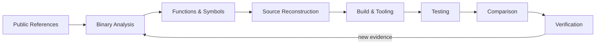

<div align="center">

# DECOMPILATION

### Analyze · Reconstruct · Build · Verify

Research and reconstruction of compiled software into readable, buildable, and verifiable source code.

[](https://github.com/SakuraiTsubaki/Decompilation/actions/workflows/repository-checks.yml)


</div>

---

## Overview

`Decompilation` is a reusable workspace for systematic reverse engineering and source reconstruction. It is designed around a traceable pipeline: collect evidence, analyze compiled behavior, reconstruct source and data, build repeatable tooling, and verify results.

The repository is intentionally target-agnostic. Target-specific decompilation projects can reuse the methodology, tools, conventions, tests, and documentation patterns developed here.

## Project Principles

| Principle | Meaning |
| --- | --- |
| **Evidence first** | Confirm behavior before assigning semantics. |
| **Reproducible work** | Prefer scripts, configs, manifests, and documented commands over one-off manual steps. |
| **Incremental reconstruction** | Keep unresolved low-level code visible until a higher-level reconstruction is justified. |
| **Traceable naming** | Names and structures should have documented reasoning or provenance. |
| **Verification matters** | A reconstruction is stronger when behavior, data, or output can be compared against a reference. |
| **Keep artifacts organized** | Analysis, tools, source, assets, tests, and documentation each have a defined home. |

## Workflow



### Working sequence

1. Collect and document publicly available reference material.
2. Analyze binaries, functions, symbols, structures, formats, and data relationships.
3. Reconstruct source code and supporting data incrementally.
4. Build reusable extraction, conversion, analysis, build, and verification tools.
5. Test reconstructed components.
6. Compare behavior or outputs against documented references.
7. Record verification results and feed new evidence back into analysis.

## Repository Map

```text
Decompilation/
├─ README.md
├─ CONTRIBUTING.md
├─ CHANGELOG.md
├─ SECURITY.md
├─ LICENSE
├─ .gitignore
├─ .gitattributes
│
├─ src/
│  ├─ code/               # Reconstructed high-level source
│  ├─ asm/                # Assembly not yet reconstructed
│  ├─ include/            # Headers, types, structures, constants
│  └─ data/               # Source-linked data definitions
│
├─ assets/
│  ├─ graphics/
│  ├─ audio/
│  ├─ text/
│  ├─ maps/
│  └─ metadata/
│
├─ analysis/
│  ├─ binaries/           # Binary layout and executable analysis
│  ├─ functions/          # Function-by-function research
│  ├─ symbols/            # Symbol, address, and naming research
│  ├─ structures/         # Structures, classes, and data models
│  ├─ formats/            # File, compression, and resource formats
│  └─ comparisons/        # Reference-versus-reconstruction results
│
├─ tools/
│  ├─ extraction/
│  ├─ conversion/
│  ├─ analysis/
│  ├─ build/
│  └─ verification/
│
├─ config/
│  ├─ symbols/
│  ├─ mappings/
│  └─ build/
│
├─ docs/
│  ├─ architecture/
│  ├─ decompilation/
│  ├─ formats/
│  ├─ progress/
│  └─ references/
│
├─ tests/
│  ├─ unit/
│  ├─ regression/
│  └─ comparison/
│
├─ scripts/
│  ├─ setup/
│  ├─ build/
│  └─ verify/
│
└─ .github/
   ├─ ISSUE_TEMPLATE/
   ├─ PULL_REQUEST_TEMPLATE.md
   └─ workflows/
```

## Progress

This table tracks repository-level capability, not any single decompilation target.

| Area | State | Notes |
| --- | --- | --- |
| Repository foundation | ✅ Ready | Base structure and policies established |
| Documentation framework | 🟡 Active | Methodology and reference material will expand with real work |
| Analysis framework | 🟡 Ready for data | Binary, function, symbol, structure, format, and comparison areas prepared |
| Source reconstruction | ⚪ Target-dependent | Populated when target work begins |
| Tooling | 🟡 Ready for implementation | Extraction through verification tool areas prepared |
| Tests | 🟡 Ready for implementation | Unit, regression, and comparison areas prepared |
| CI verification | ✅ Enabled | Repository structure, forbidden binaries, and script syntax are checked automatically |

## Automation

GitHub Actions runs repository checks on pushes and pull requests. The checks are designed to grow with the project and currently cover:

- required repository structure;
- accidental tracking of common ROM/installable game package formats;
- Python syntax when Python tools exist;
- shell-script syntax when shell tools exist;
- trailing whitespace in tracked text files.

## Contribution Model

See [`CONTRIBUTING.md`](CONTRIBUTING.md) before adding analysis, reconstructed source, tools, or verification material. Issue forms are available for function analysis, binary/file-format research, decompilation tasks, and verification work.

Useful expectations:

- distinguish confirmed findings from hypotheses;
- document evidence and provenance;
- use temporary symbol names instead of inventing semantics;
- keep changes focused and reviewable;
- explain how reconstructed behavior was verified.

## Repository Policy

Publicly distributable source code, analysis, documentation, manifests, metadata, scripts, tools, tests, patches, and generated non-ROM artifacts may be tracked here.

Original, modified, or rebuilt ROM binaries and installable game packages are not stored in this repository.

Empty working directories are retained with `.gitkeep` until real files replace them.

## Changelog

Repository-level changes are recorded in [`CHANGELOG.md`](CHANGELOG.md).

## License

No open-source license has been selected yet. See [`LICENSE`](LICENSE) for the current repository terms.

---

<div align="center">

**Decompilation is not just source recovery. It is evidence, reconstruction, and verification.**

</div>
